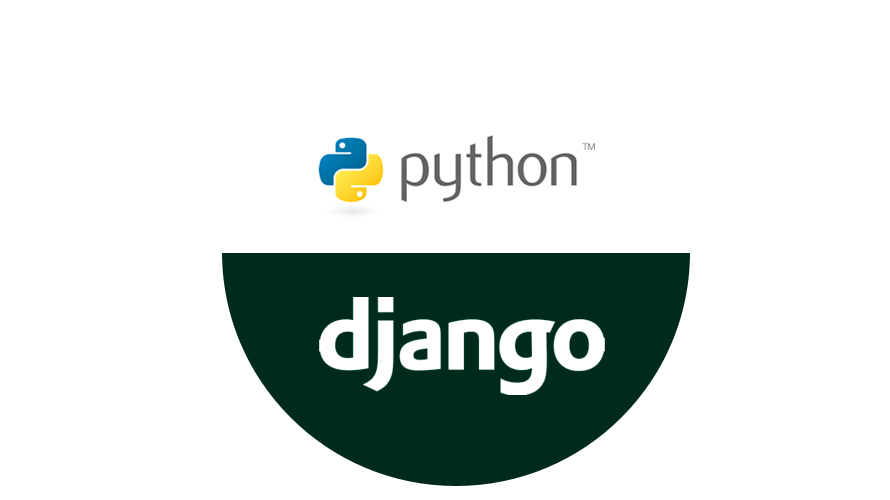
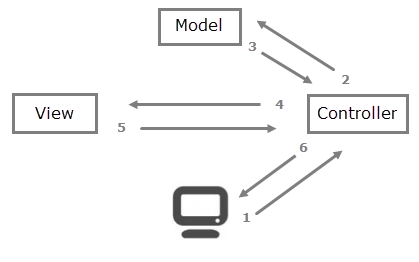

---
title:
- Django
author:
- Dario Necco
theme:
- Nalug
date:
- Feb 02, 2022
---

---#


---#
# Introduction
* Django is a Python-based free and open-source web framework that follows the model–template–views architectural pattern. It is maintained by the Django Software Foundation, an independent organization established in the US as a 501 non-profit.

* Created in 2003, by the Lawrence Journal-World newspaper, Adrian Holovaty and Simon Willison

* Released publicly under a BSD license in July 2005

* The framework was named after guitarist Django Reinhardt.

* In June 2008, it was announced that a newly formed Django Software Foundation (DSF) would maintain Django in the future.

---## 
# Django MTV

Django follows MVC pattern very closely but it uses slightly different terminology. Django is essentially an MTV (Model-Template-View) framework. Django uses the term Templates for Views and Views for Controller. In other words, in Django views are called templates and controllers are called views.

---#
# MVC

MVC architecture divides an application into the following three layers:

1. Model
1. View
1. Controller



---##
## Model
* Models represents how data is organized in the database. 
* In MVC pattern we use models to define our database tables as well as the relationships between them.

---##
## Views
* A view is what you see when you visit a site. 

* For example, a blog post, a contact form etc, are all examples of views. 

* A View contains all the information that will be eventually sent to the client i.e a web browser. Generally, views are HTML documents.

---##
## Controller
* Controller controls the flow of information. 

* When you request a page that request is passed to the controller then it uses programmed logic to decide what information is needed to pull from the database and what information should it pass to the view. The controller is the heart of the MVC architecture because it acts as a glue between models and views.

---##
## Steps involved in an MVC application

1. Web browser or client sends the request to the web server, asking the server to display a blog post.

1. The request received by the server is passed to the controller of the application.

1. The controller asks the model to fetch the blog post.

1. The model sends the blog post to the controller.

1. The controller then passes the blog post data to the view.

1. The view uses blog post data to create an HTML page.

1. At last, the controller returns the HTML content to the client.


---##
## Note

* Django calls **Controller** the "view", and the **View** the "template"


---# 
# GET vs POST request

* `GET`: is used to request data from a specified resource (not modify).
    * GET requests can be cached and remain in the browser history
    * GET requests can be bookmarked
    * GET requests should never be used when dealing with sensitive data
    * GET requests have length restrictions

```
/test/demo_form.php?name1=value1&name2=value2
```

* `POST`: is used to send data to a server to create/update a resource.
    * POST requests are never cached and don't remain in the browser history
    * POST requests cannot be bookmarked
    * POST requests have no restrictions on data length


---#
# Why Django

* Among others python web frameworks (flask, fastapi, etc), it provides everything out-of-box: database, authentication, template engine.

* It allows to switch easily from a database to another (by default sqlite3 is used)

---#
# Installation and Setup

### 1 - Create virtual environment

```bash
# Install virtualenv module
pip3 install virtualenv

# Create virtual environment
virtualenv ${virtual-environment-name}   

# Activate virtual environment
source ${virtual-environment-name}/bin/activate  #    Linux
${virtual-environment-name}\Scripts\activate.bat #    Windows
```

### 2 - Install Django

```bash
pip3 install django
```

### 3 - Create Django project

```bash
# create django project
django-admin startproject ${project-name} . 
```

---##

* Supposing we call the project "core"
```
<current-folder>/
│
└── core/
    │
    ├── core/
    │   ├── __init__.py
    │   ├── asgi.py
    │   ├── settings.py
    │   ├── urls.py
    │   └── wsgi.py
    │
    └── manage.py
```

---##

* If the dot is omitted, the additional top-level project folder is avoided
```
<current-folder>/
│
├── core/
│   ├── __init__.py
│   ├── asgi.py
│   ├── settings.py
│   ├── urls.py
│   └── wsgi.py
│
└── manage.py
```

---## 

### 4 - Create Django app

* Django is formed of apps, which allow to keep the source code separated and organized.

```bash
django-admin startapp ${app-name}
```

---##

```
<project-folder>/
│
├── example/
│   │
│   ├── migrations/
│   │   └── __init__.py
│   │
│   ├── __init__.py
│   ├── admin.py
│   ├── apps.py
│   ├── models.py
│   ├── tests.py
│   └── views.py
│
├── <project-name>/
│   ├── __init__.py
│   ├── asgi.py
│   ├── settings.py
│   ├── urls.py
│   └── wsgi.py
│
└── manage.py
```

---##


```bash
{data-line-numbers="18|19|13|11|5"}
<project-folder>/
│
├── example/
│   │
│   ├── migrations/
│   │   └── __init__.py
│   │
│   ├── __init__.py
│   ├── admin.py
│   ├── apps.py
│   ├── models.py
│   ├── tests.py
│   └── views.py
│
├── <project-name>/
│   ├── __init__.py
│   ├── asgi.py
│   ├── settings.py
│   ├── urls.py
│   └── wsgi.py
│
└── manage.py
```

---##

### 5 - Declare app in Django project

* In `/settings.py`, to **INSTALLED_APPS** list, add:
    
```bash
'app.apps.AppConfig'  # main app
```
    
where:

- `app` is the folder name
- `apps` refers to `app\apps.py`
- `AppConfig` is the Class name

---##

### 6 - Set template folder

* In `/settings.py`, to **TEMPLATES** list, add the template path:
```bash
TEMPLATES = [
    {
        ...
        'DIRS': [os.path.join(BASE_DIR, 'templates')],  # new
        ...
    },
]
```

* Create `templates` folder in the project root

* The template engine is `jinja2`

---##

### 7 - Apply the changes

```bash
python manage.py makemigrations
python manage.py migrate
```

---## 

### 8 - Create the first user (admin)

```bash
python manage.py createsuperuser
```

or 

```bash
python manage.py createsuperuser --username ${username} --email ${email}
```

---##

### 9 - Run Django server

```bash
python manage.py runserver
```

---##

### 9 - Create the first route

* /urls.ypy

```python
from django.shortcuts import render, redirect
from django.contrib.auth.decorators import login_required

@login_required
def home(request):
    return render(request, "home.html", {})
```


---#

# Use static files

* It allows to serve static files (js, image, css, etc.)

* Per Django structure, static files are located in each app

* Collect all apps' static files into the main static folder

```python
python manage.py collectstatic --noinput --clear
```

* Use static files in template for rendering

```html


...

<link rel="stylesheet" href="">
```

---# 
# Additional settings (`/settings.py`)

* Allow all hosts to connect:

```python
ALLOWED_HOSTS = ['*']
```

* Enable/disable DEBUG: Detailed error pages: if your app raises an exception when DEBUG is True, Django will display a detailed traceback, including a lot of metadata about your environment

```python
DEBUG = True
```

!!! warning

    &bull; `DEBUG = True` exposes the server to security flaws
    
    &bull; Due to storage of each SQL query execution and other debug info, it consumes more memory on a production server.


